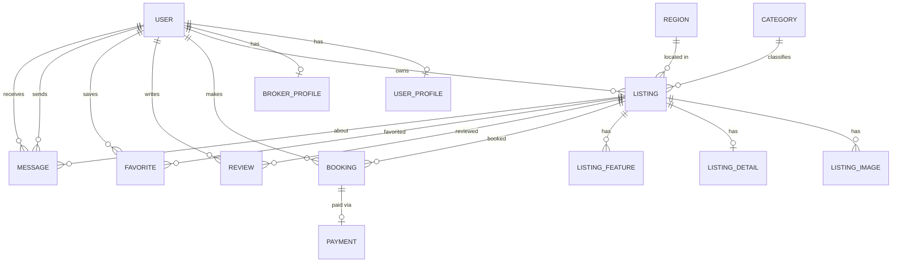

# 2.1. Rentally - Өгөгдлийн сангийн зохиомж

## Тодорхойлолт

**Rentally** нь үл хөдлөх хөрөнгийн түрээсийн платформ бөгөөд PostgreSQL (NeonDB) өгөгдлийн сан дээр суурилсан. Системд нийт **13 хүснэгт** ашиглагдана.

---

## Объектын холбоосон диаграмм (ОХД / ER Diagram)

---

## Өгөгдлийн ерөнхий схем (ӨЕС)

### 1. Хэрэглэгч (auth_user)

| Баганын нэр | ӨС нэр | Түлхүүр | Төрөл | Тайлбар |
|---|---|---|---|---|
| id | id | **PK** | `SERIAL` | Автомат ID |
| username | username | UQ | `VARCHAR(150)` | Нэвтрэх нэр |
| email | email | UQ | `VARCHAR(254)` | Имэйл хаяг |
| password | password_hash | | `VARCHAR(128)` | Нууц үг (hash) |

### 2. Хэрэглэгчийн профайл (user_profiles)

| Баганын нэр | ӨС нэр | Түлхүүр | Төрөл | Тайлбар |
|---|---|---|---|---|
| Хэрэглэгч ID | user_id | **PK, FK** | `INTEGER` | auth_user → id |
| Үүрэг | role | | `VARCHAR(20)` | user / broker / admin |
| Утас | phone | | `VARCHAR(20)` | +976 9911 2233 |
| Хаяг | address | | `TEXT` | |
| Зураг | profile_picture | | `URL` | |
| Баталгаажсан эсэх | is_verified | | `BOOLEAN` | |
| Үүсгэсэн огноо | created_at | | `TIMESTAMPTZ` | |
| Шинэчилсэн огноо | updated_at | | `TIMESTAMPTZ` | |

### 3. Зуучлагчийн профайл (broker_profiles)

| Баганын нэр | ӨС нэр | Түлхүүр | Төрөл | Тайлбар |
|---|---|---|---|---|
| Хэрэглэгч ID | user_id | **PK, FK** | `INTEGER` | auth_user → id |
| Компаний нэр | company_name | | `VARCHAR(255)` | |
| Бүртгэлийн дугаар | registration_number | UQ | `VARCHAR(100)` | |
| Тайлбар | description | | `TEXT` | |
| Вебсайт | website | | `URL` | |
| Лиценз | license_document | | `URL` | |
| Төлөв | status | | `VARCHAR(20)` | pending/approved/rejected |
| Баталгаажсан огноо | verified_at | | `TIMESTAMPTZ` | |

### 4. Ангилал (categories)

| Баганын нэр | ӨС нэр | Түлхүүр | Төрөл | Тайлбар |
|---|---|---|---|---|
| ID | id | **PK** | `SERIAL` | |
| Нэр | name | UQ | `VARCHAR(100)` | apartment, house, office |
| Slug | slug | UQ | `VARCHAR(100)` | URL-д ашиглах |
| Дүрс | icon | | `URL` | |
| Тайлбар | description | | `TEXT` | |

### 5. Бүс нутаг (regions)

| Баганын нэр | ӨС нэр | Түлхүүр | Төрөл | Тайлбар |
|---|---|---|---|---|
| ID | id | **PK** | `SERIAL` | |
| Нэр | name | UQ | `VARCHAR(100)` | Дүүрэг/аймаг нэр |
| Slug | slug | UQ | `VARCHAR(100)` | |
| Улс | country | | `VARCHAR(100)` | Default: Mongolia |

### 6. Зар (listings)

| Баганын нэр | ӨС нэр | Түлхүүр | Төрөл | Тайлбар |
|---|---|---|---|---|
| ID | id | **PK** | `SERIAL` | |
| Эзэмшигч | owner_id | **FK** | `INTEGER` | auth_user → id |
| Ангилал | category_id | **FK** | `INTEGER` | categories → id |
| Бүс нутаг | region_id | **FK** | `INTEGER` | regions → id |
| Гарчиг | title | | `VARCHAR(255)` | |
| Тайлбар | description | | `TEXT` | |
| Хаяг | address | | `VARCHAR(255)` | |
| Өргөрөг | latitude | | `DECIMAL(10,7)` | GPS координат |
| Уртраг | longitude | | `DECIMAL(10,7)` | GPS координат |
| Үнэ | price | | `DECIMAL(14,0)` | ₮ |
| Үнийн төрөл | price_type | | `VARCHAR(20)` | daily/monthly/yearly |
| Төлөв | status | | `VARCHAR(20)` | active/inactive/sold/archived |
| Онцлох | is_featured | | `BOOLEAN` | |
| Үзсэн тоо | views_count | | `INTEGER` | Default: 0 |

### 7. Зарын зураг (listing_images)

| Баганын нэр | ӨС нэр | Түлхүүр | Төрөл | Тайлбар |
|---|---|---|---|---|
| ID | id | **PK** | `SERIAL` | |
| Зар ID | listing_id | **FK** | `INTEGER` | listings → id (CASCADE) |
| Зургийн URL | image_url | | `URL` | |
| Alt текст | alt_text | | `VARCHAR(255)` | |
| Үндсэн зураг | is_primary | | `BOOLEAN` | Зар бүрт 1 л байна |
| Дараалал | sort_order | | `INTEGER` | |

### 8. Зарын дэлгэрэнгүй (listing_details)

| Баганын нэр | ӨС нэр | Түлхүүр | Төрөл | Тайлбар |
|---|---|---|---|---|
| ID | id | **PK** | `SERIAL` | |
| Зар ID | listing_id | **FK, UQ** | `INTEGER` | listings → id (CASCADE) |
| Өрөө | bedrooms | | `INTEGER` | |
| Угаалгын өрөө | bathrooms | | `INTEGER` | |
| Талбай (м²) | area_sqm | | `INTEGER` | |
| Шалны төрөл | floor_type | | `VARCHAR(100)` | |
| Цонхны төрөл | window_type | | `VARCHAR(100)` | |
| Хаалганы төрөл | door_type | | `VARCHAR(100)` | |
| Тагт | balcony | | `BOOLEAN` | |
| Гараж | garage | | `BOOLEAN` | |
| Баригдсан он | year_built | | `INTEGER` | |
| Давхар | floor_number | | `SMALLINT` | |
| Нийт давхар | building_floors | | `SMALLINT` | |
| Цонх тоо | window_count | | `SMALLINT` | |
| Төлбөр нөхцөл | payment_terms | | `TEXT` | |
| Коммунал зардал | utilities_estimated | | `DECIMAL(10,2)` | |
| Халаалт төрөл | heating_type | | `VARCHAR(100)` | |
| Агааржуулалт | air_type | | `VARCHAR(100)` | |

### 9. Зарын онцлог (listing_features)

| Баганын нэр | ӨС нэр | Түлхүүр | Төрөл | Тайлбар |
|---|---|---|---|---|
| ID | id | **PK** | `SERIAL` | |
| Зар ID | listing_id | **FK** | `INTEGER` | listings → id (CASCADE) |
| Нэр | name | | `VARCHAR(100)` | (listing_id, name) UNIQUE |
| Утга | value | | `VARCHAR(255)` | |

### 10. Захиалга (bookings)

| Баганын нэр | ӨС нэр | Түлхүүр | Төрөл | Тайлбар |
|---|---|---|---|---|
| ID | id | **PK** | `SERIAL` | |
| Зар ID | listing_id | **FK** | `INTEGER` | listings → id |
| Хэрэглэгч ID | user_id | **FK** | `INTEGER` | auth_user → id |
| Эхлэх огноо | start_date | | `TIMESTAMP` | |
| Дуусах огноо | end_date | | `TIMESTAMP` | end > start |
| Нийт үнэ | total_price | | `DECIMAL(12,2)` | Автомат тооцоолно |
| Төлөв | status | | `VARCHAR(20)` | pending/confirmed/checked_in/checked_out/cancelled |
| Тэмдэглэл | notes | | `TEXT` | |

### 11. Үнэлгээ (reviews)

| Баганын нэр | ӨС нэр | Түлхүүр | Төрөл | Тайлбар |
|---|---|---|---|---|
| ID | id | **PK** | `SERIAL` | |
| Зар ID | listing_id | **FK** | `INTEGER` | listings → id |
| Хэрэглэгч ID | user_id | **FK** | `INTEGER` | auth_user → id |
| Үнэлгээ | rating | | `INTEGER` | 1-5 ★ (CHECK) |
| Сэтгэгдэл | comment | | `TEXT` | |
| Баталгаатай эсэх | is_verified_booking | | `BOOLEAN` | |
| Тусламжтай тоо | helpful_count | | `INTEGER` | |

> [!NOTE]
> `(listing_id, user_id)` UNIQUE — нэг хэрэглэгч нэг зарт 1 л үнэлгээ өгнө.

### 12. Дуртай (favorites)

| Баганын нэр | ӨС нэр | Түлхүүр | Төрөл | Тайлбар |
|---|---|---|---|---|
| Хэрэглэгч ID | user_id | **PK** | `INTEGER` | auth_user → id |
| Зар ID | listing_id | **PK** | `INTEGER` | listings → id |
| Хадгалсан огноо | created_at | | `TIMESTAMPTZ` | |

### 13. Мессеж (messages)

| Баганын нэр | ӨС нэр | Түлхүүр | Төрөл | Тайлбар |
|---|---|---|---|---|
| ID | id | **PK** | `SERIAL` | |
| Илгээгч | sender_id | **FK** | `INTEGER` | auth_user → id |
| Хүлээн авагч | receiver_id | **FK** | `INTEGER` | auth_user → id |
| Зар ID | listing_id | **FK** | `INTEGER` | listings → id (NULL боломжтой) |
| Мессеж | message | | `TEXT` | Хоосон байж болохгүй |
| Уншсан эсэх | is_read | | `BOOLEAN` | Default: false |
| Уншсан огноо | read_at | | `TIMESTAMPTZ` | |

### 14. Төлбөр (payments)

| Баганын нэр | ӨС нэр | Түлхүүр | Төрөл | Тайлбар |
|---|---|---|---|---|
| ID | id | **PK** | `SERIAL` | |
| Захиалга ID | booking_id | **FK, UQ** | `INTEGER` | bookings → id (1:1) |
| Дүн | amount | | `DECIMAL(12,2)` | ≥ 0 |
| Валют | currency | | `VARCHAR(3)` | Default: MNT |
| Төлөв | status | | `VARCHAR(20)` | pending/completed/failed/refunded |
| Төлбөр арга | payment_method | | `VARCHAR(100)` | |
| Гүйлгээ ID | transaction_id | | `VARCHAR(255)` | |
| Төлсөн огноо | completed_at | | `TIMESTAMPTZ` | |
